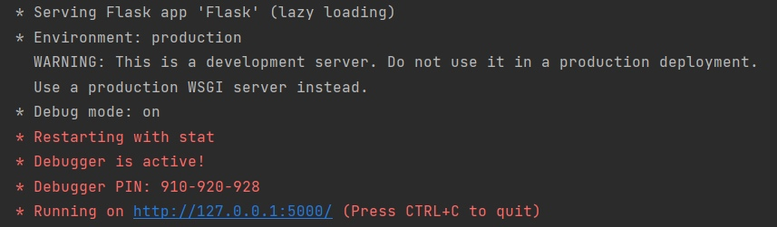
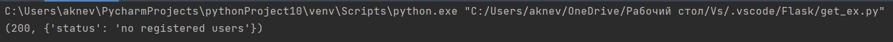
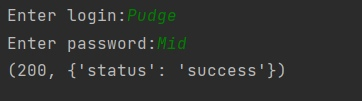
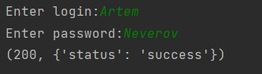
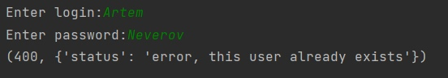
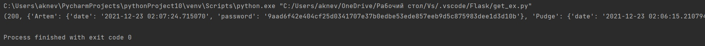

# 9_flask_app(creating microserver)

Сервис находится в файле [Flask.py](Flask.py) и запускается корректно.

При попытке воспользоваться запросом GET(получение информации о пользователях)[get_ex.py](get_ex.py) до регистрации первого пользователя выводится соответствующее уведомление.

Post запрос реализован в [reg_ex.py](reg_ex.py) и реализует регистрацию пользователей.

При попытке регистрации уже существующего пользователя выдает соответствующее уведомление.

Get запрос реализован через вывод информации о зарегистрированных пользователях.

